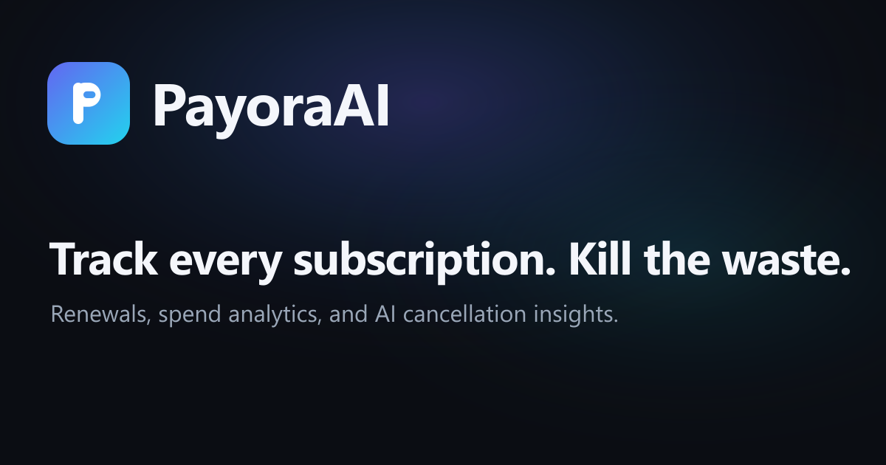

# 💸 PayoraAI - Subscription Tracker

Track every subscription, see where your money goes, and kill the waste. PayoraAI gives
you a premium dashboard for recurring payments, renewal reminders, spend analytics, and
AI-powered cancellation suggestions.

Works instantly as a **guest** (data stays on your device), or **sign in** to sync your
data across devices via Supabase.

## Live Preview

**Live:** https://payora-ai.netlify.app



## Stack

- **Next.js 15** (App Router) + **TypeScript**
- **Tailwind CSS v3** + shadcn/ui-style primitives (Radix)
- **Framer Motion** for micro-interactions & page transitions
- **Zustand** (+ `persist`) for client state and guest storage
- **Supabase** for auth + per-user cloud data (optional)
- **next-themes** for dark/light mode (dark by default, no flash)
- **Recharts** for spend visualizations
- **date-fns** for renewal math
- **simple-icons** + **react-icons** for brand logos
- **@anthropic-ai/sdk** (`claude-sonnet-4-6`) for AI insights, Q&A, and auto-fill

## Quick start

```bash
npm install
npm run dev
```

Open [http://localhost:3000](http://localhost:3000), hit **Try the live demo**, and
**Continue as guest** to explore with sample data right away.

To enable AI Insights and real accounts, follow [guide.md](./guide.md): it covers the
Anthropic key and the (free) Supabase setup step by step.

## Features

- **Landing page**: public, modern marketing page; every app route is protected behind it.
- **Auth**: email/password and Google / GitHub OAuth via Supabase, plus a one-click **guest mode** with mock data.
- **Dashboard**: hero stats, color-coded upcoming renewals, recent activity, AI panel, quick-add.
- **Subscriptions**: fuzzy search, searchable category picker, filter (category / status / billing), sort, grid/list toggle, slide-over detail with full CRUD + pause/resume/archive. Duplicate names are blocked.
- **Analytics**: real 12-month spend trend (built from each subscription's start date), category donut, billing cadence, "most expensive" & "longest held".
- **Multi-currency**: every subscription keeps its own currency; totals convert into your default currency using live FX rates (`/api/fx`, cached, with offline fallback).
- **AI (Claude, server-side)**: cancellation **Insights**, free-form **Ask AI** about your stack, and **auto-fill** of category + billing cycle when adding a subscription.
- **Renewal reminders**: optional browser notifications for renewals within your threshold.
- **PWA**: installable, with an offline service worker.
- **Settings**: profile (display name, account info, sign out), default currency (14 currencies with SVG flags that render on every OS, INR by default), reminder threshold, renewal-notification toggle, JSON import/export, clear-all. Every change confirms with a toast.
- **Brand logos**: 160+ colored Simple Icons, plus uncolored react-icons fallbacks (Amazon, Microsoft, Prime Video, Amazon Music, etc.) with distinct marks per sub-brand.

## Data & sync

- **Guests** use `localStorage` (Zustand `persist`); data stays on the device.
- **Signed-in users** get their full dataset stored as a single JSON row in Supabase,
  protected by Row Level Security, loaded on sign-in and saved (debounced) on change.
- If Supabase isn't configured, the app gracefully runs in guest-only mode.

## Accessibility & performance

- Focus trap in dialogs/sheets (Radix), `aria-*` labels, keyboard-navigable controls.
- `prefers-reduced-motion` respected via Framer Motion and a global CSS fallback.
- Charts and the AI panel are lazy-loaded with `next/dynamic`; fonts via `next/font`.
- Off-screen brand icons use CSS containment so the picker stays smooth.
- SEO-ready: per-page metadata, `robots.txt` + `sitemap.xml`, a 1200x630 Open Graph image, private routes marked `noindex`, and a branded favicon.

## Project structure

```
app/            landing (/), login, (app) protected routes, api (ai-*, fx), manifest/robots/sitemap
components/     auth, brand, layout, dashboard, subscriptions, analytics, ai, ui (primitives)
lib/            types, constants, utils, store, supabase, cloud, fx, brand resolution
hooks/          useSubscriptions, useSpendSummary
```

See [guide.md](./guide.md) for full setup and deployment instructions.
